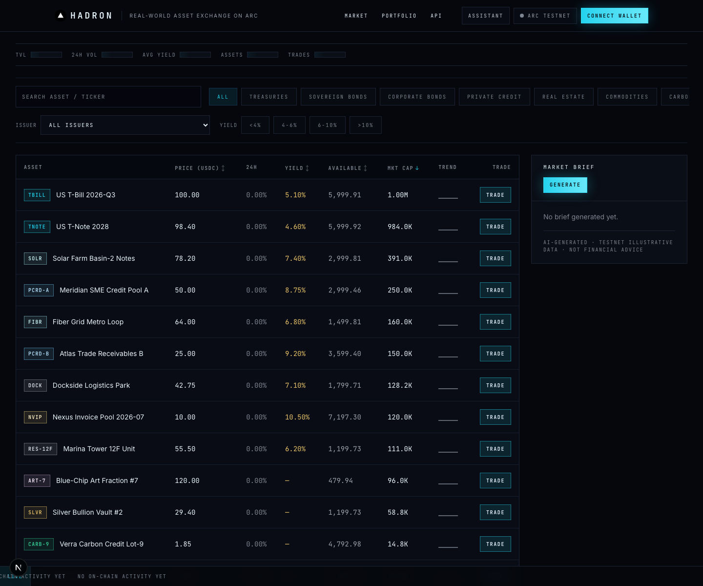
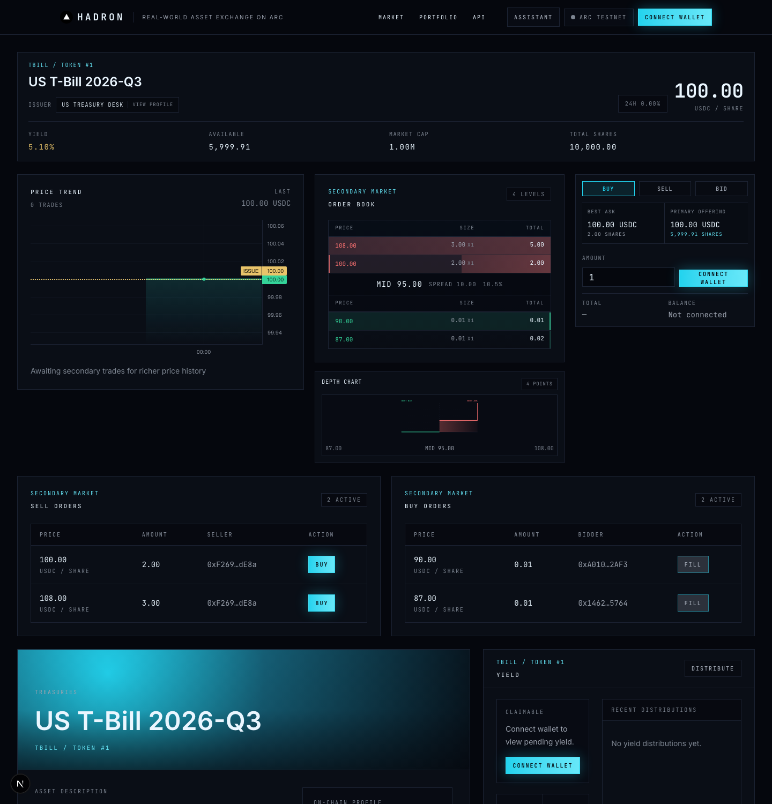
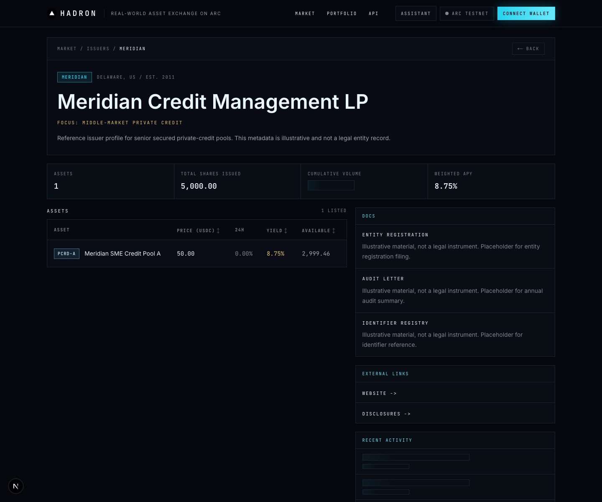
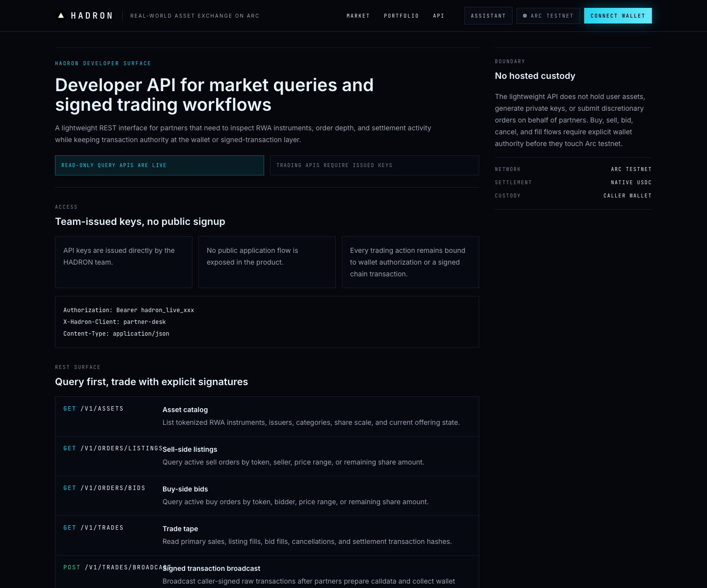
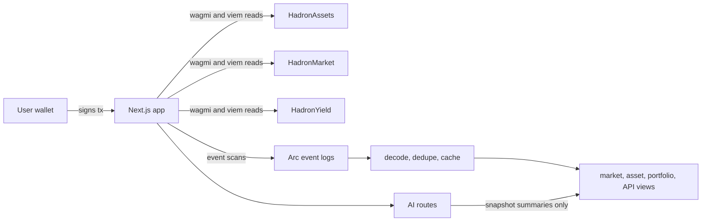

# HADRON

HADRON is an experimental real-world asset exchange built on Arc Testnet. It turns a curated catalog of tokenized asset shares into a working on-chain market with primary issuance, secondary listings, buy-side bids, yield distribution, portfolio management, developer APIs, and AI-assisted trading workflows, all settled in native USDC.

The project is built to demonstrate what an Arc-native RWA venue can feel like when the product experience is polished, but the market loop remains contract-verifiable rather than simulated behind a private database.

> Testnet notice: HADRON uses illustrative assets and testnet contracts. It is not an investment product, broker-dealer system, custody product, legal offering, or financial advice.

## Screenshots

The screenshots below were captured from the local web app connected to the current Arc Testnet deployment on July 8, 2026.









## Table of Contents

- [Why HADRON Exists](#why-hadron-exists)
- [What HADRON Demonstrates](#what-hadron-demonstrates)
- [Product Tour](#product-tour)
- [Current Arc Testnet Deployment](#current-arc-testnet-deployment)
- [Architecture](#architecture)
- [Smart Contracts](#smart-contracts)
- [Web Application](#web-application)
- [AI Layer](#ai-layer)
- [Developer API](#developer-api)
- [Repository Layout](#repository-layout)
- [Local Development](#local-development)
- [Verification](#verification)
- [Security Model](#security-model)
- [Project Workflow](#project-workflow)
- [Contributing](#contributing)

## Why HADRON Exists

Arc is a natural place to explore stablecoin-native financial applications: settlement is fast, USDC is the unit of account, and the chain is designed for payment and capital-market workflows. HADRON uses that environment to prototype a focused question:

> What would a transparent RWA exchange look like if issuance, order custody, settlement, yield accounting, and transaction evidence all lived on-chain?

Most RWA demos stop at static cards or a custodial backend. HADRON is intentionally more concrete. The app reads from deployed contracts, uses wallet-signed transactions for market actions, shows transaction hashes for acceptance evidence, and keeps AI assistance outside the final settlement path.

The name follows the product metaphor: if lightweight market signals are "leptons", HADRON is the heavier venue that carries real asset weight.

## What HADRON Demonstrates

HADRON is not just a landing page. The current testnet build includes:

- A seeded catalog of 14 RWA-style assets across treasuries, private credit, real estate, commodities, carbon, infrastructure, art, and invoice financing.
- ERC-1155 asset shares with deterministic token IDs and on-chain asset metadata.
- Primary offerings priced in native USDC.
- Secondary sell listings with escrowed shares.
- Buy-side bids with escrowed native USDC.
- Partial fills, cancellations, exact payment checks, and protocol fee routing.
- Exchange-style market depth: best ask, best bid, spread, cumulative order-book levels, and depth chart.
- Portfolio views for wallet holdings, open listings, and open bids.
- Asset-level yield distribution through a dedicated `HadronYield` contract.
- Issuer profile pages that connect assets to richer RWA narrative metadata.
- A developer API surface for market queries and signed trading workflows.
- Optional AI market briefs, asset insights, and a natural-language trading assistant.

The project is deliberately testnet-first. That makes it possible to demonstrate real wallet flows without implying production readiness or regulatory completeness.

## Product Tour

### Market Overview

The market page is the entry point for community users. It presents the full catalog, category filters, issuer filters, yield buckets, market statistics, and an AI-generated market brief panel.

Key details:

- Asset rows show ticker, name, price, 24h movement, APY, available shares, market cap, and a trade action.
- Filters are URL-backed, so market views can be shared.
- The live ticker is driven by parsed market events.
- Market data comes from contract reads and event scans, not a hand-maintained spreadsheet.

### Asset Detail And Order Book

Each asset has a trading workspace with:

- Asset identity, issuer, token ID, price, supply, market cap, yield, and availability.
- A price trend panel.
- A stacked bid/ask order book with spread and mid-price.
- A cumulative depth chart.
- A buy/sell/bid panel.
- Sell-order and buy-order tables with wallet action buttons.
- Yield claim and distribution panels.
- On-chain profile metadata.

The order book is intentionally bilateral. A user can buy from sell-side listings, or sell into buy-side bids, which makes the page feel closer to a real exchange surface than a simple fixed-price minting page.

### Issuer Profiles

Issuer pages add context around the asset catalog. They group assets by issuer, show total issued shares, cumulative activity, weighted APY, documents, external links, and recent activity.

These profiles are illustrative, but they are useful for the RWA narrative: community reviewers can see how an issuer layer, an asset registry, and a trading venue can fit together.

### Developer Surface

The developer API page documents a partner-oriented surface for:

- Reading assets, listings, bids, and trades.
- Preparing signed market actions.
- Broadcasting caller-signed transactions.
- Checking transaction status.

The important boundary is that HADRON does not host custody or sign for users. Partner flows prepare calldata and metadata, while transaction authority remains with the wallet or an already signed raw transaction.

## Current Arc Testnet Deployment

The deployment source of truth is [`contracts/deployments/arc-testnet.json`](contracts/deployments/arc-testnet.json).

| Item | Value |
| --- | --- |
| Network | Arc Testnet |
| Chain ID | `5042002` |
| RPC | `https://rpc.testnet.arc.network` |
| Explorer | `https://testnet.arcscan.app` |
| Settlement asset | Native `USDC` |
| On-chain decimals | `18` |
| Deploy block | `50024851` |
| `HadronAssets` | `0xA3d3315Ae24D5047E9fA1736Eb98bebF8fA3fc6F` |
| `HadronMarket` | `0xF5AB3ef3906aA089523Fc63D58d885b60ff58dAc` |
| `HadronYield` | `0x00579D460210Ee74a6547d0144a5eEAF1C799a87` |
| Treasury | `0x84e243a60a75eFe615537af49c5eAEe8F3C32ED9` |
| Protocol fee | `50 bps` (`0.5%`) |
| Active seeded catalog | 14 assets, `FIRST_ACTIVE_TOKEN_ID = 1` |

Seeded V6 state includes:

| Seeded item | Count |
| --- | ---: |
| Assets | 14 |
| Primary offerings | 14 |
| Secondary listings | 35 |
| Buy-side bids | 41 |
| Bid fills | 7 |
| Yield deposits | 3 |
| Sample yield claims | 1 |

Older deployment addresses are preserved in the deployment JSON for audit history, but the addresses above are the current environment used by the web app.

Example acceptance transactions:

- Primary buy smoke test: `0x320fa3fa559739a91dc4298a2bc431682751039ae094d9785f0c1059c5d3bd06`
- Fractional primary buy: `0xf3b7cc241dbc776955725e84cb77dbd4a750e0c7c18c812fa160c4c5a58539e7`
- Secondary listing buy: `0x9909b3477393595e70beb076d1474c19bdea4619473fc9c3f23977fa5eea75dd`
- User listing: `0xa6e8874c3b40368e107eef5d6a965c9710c42221f19c1891f28d8b32753b2c2c`
- Listing cancellation: `0x60ed325f4c2991ad0d3d41fc65cc662680cab51716e45765f3e41d507964d7bd`

## Architecture

```text
contracts/
  src/
    HadronAssets.sol    ERC-1155 asset registry and share token
    HadronMarket.sol    Primary offerings, listings, bids, fills, cancellations, fees
    HadronYield.sol     Asset-level USDC yield accounting and claims
  script/               Deployment and seeding scripts
  test/                 Foundry tests, fuzz tests, and adversarial fixtures

web/
  app/                  Next.js App Router pages and API routes
  components/           Market, asset, portfolio, assistant, issuer, and UI surfaces
  content/              Static asset and issuer metadata used by the UI narrative layer
  lib/                  Contract clients, hooks, event parsing, AI, formatting, and order books
  test/                 Vitest coverage for hooks, components, data transforms, APIs, and AI

openspec/
  specs/                Current capability specifications
  changes/              Active and archived OpenSpec changes
```

High-level data flow:



The web app uses wagmi, viem, and TanStack Query for chain interaction. Public market data is read from contract getters and event logs. Transaction outcomes are fed back into the UI through precise query invalidation and event-driven refreshes.

## Smart Contracts

### `HadronAssets`

`HadronAssets` is the ERC-1155 registry for tokenized RWA-style shares.

Responsibilities:

- Create asset records with name, category, total shares, and metadata URI.
- Mint the full supply of each asset to the issuer/owner at creation time.
- Expose `assetCount`, `getAsset`, and `uri(tokenId)` so the front end can enumerate assets without relying only on historical events.
- Notify the yield hook on transfers once the yield system is configured.
- Reject duplicate token IDs in batch transfer paths that could break yield accounting invariants.

### `HadronMarket`

`HadronMarket` is the exchange contract.

Primary market:

- Owner creates offerings by escrowing ERC-1155 shares.
- Buyers call `buyPrimary(offeringId, amount)` with exact native USDC payment.
- Settlement splits proceeds between issuer and treasury using the configured protocol fee.
- Offerings can be closed, returning unsold shares.

Secondary sell-side market:

- Holders list shares with `list(tokenId, amount, pricePerShare)`.
- Listed shares are escrowed by the market contract.
- Buyers can partially or fully fill listings.
- Sellers can cancel open listings and recover remaining shares.

Secondary buy-side market:

- Bidders call `placeBid(tokenId, amount, pricePerShare)` with exact native USDC escrow.
- Holders can fill bids by transferring shares to the bidder.
- Bidders can cancel open bids and recover remaining escrow.
- Contract bidders must expose ERC-1155 receiver support so bids cannot become unfillable fake depth.

Safety properties:

- Market write functions use non-reentrancy protections.
- Fee basis points are bounded.
- Treasury updates are evented.
- Admin functions cannot sweep user escrowed shares or escrowed native USDC.
- Adversarial tests cover malicious receivers, payment reverts, callback reentry, and escrow conservation.

### `HadronYield`

`HadronYield` distributes native USDC yield by token ID.

Responsibilities:

- Accept `depositYield(tokenId)` payments.
- Track per-share accumulated yield with high precision.
- Exclude market escrow and issuer inventory accounts from distributions.
- Settle transfer-side accrual through the asset transfer hook.
- Support `claimYield(tokenId)` and `claimYieldBatch(tokenIds)`.
- Keep repeated claims and duplicate batch token IDs idempotent.

The result is a testnet model for asset-level distributions where yield follows current circulating share ownership without rewarding escrowed or issuer inventory balances.

## Web Application

The web app is built with Next.js 16, React 19, TypeScript, Tailwind CSS, wagmi, viem, Reown AppKit, TanStack Query, and lightweight-charts.

Core UI areas:

- `Market`: catalog table, filters, stats strip, live ticker, market brief, and activity panel.
- `Asset detail`: profile, chart, order book, depth chart, trade tabs, listing tables, bid tables, yield panel, and issuer/profile metadata.
- `Portfolio`: wallet holdings, open listings, open bids, resale modal, and order management.
- `Issuer profile`: issuer narrative metadata, asset table, documents, external links, and activity.
- `Developer API`: partner-facing REST documentation and signed transaction boundaries.
- `Assistant`: natural-language command panel and structured confirmation cards.

Data freshness strategy:

- HOT queries: public listings and bids.
- WARM queries: user-related state such as pending yield and wallet orders.
- COLD queries: static registry and offering data.
- Event polling scans Arc logs, decodes known market events, deduplicates them, and caches timestamps.
- Browser tabs pause interval polling while hidden.
- viem HTTP transports use JSON-RPC batching.
- Transaction success paths invalidate only affected query families instead of refreshing the entire cache.

## AI Layer

HADRON includes two AI modes:

1. Market and asset insights.
2. Intent parsing for the assistant.

The AI layer is intentionally constrained.

- AI never sees private keys.
- AI does not choose final token IDs, contract addresses, calldata, or `msg.value`.
- Asset matching is deterministic after the model extracts a user-facing symbol or name.
- Read query cards use contract data, not model-generated numbers.
- Write actions produce confirmation cards before any wallet signature.
- Unsupported or ambiguous commands degrade to clarification cards.
- In development, missing `DEEPSEEK_API_KEY` falls back to mock streams for demos.
- In production, missing AI configuration returns an explicit service error.

Supported assistant intents include:

- `query_price`
- `query_depth`
- `query_holdings`
- `query_yield`
- `buy`
- `sell`
- `cancel`
- `claim`
- `unknown`

This keeps the assistant useful without turning it into an autonomous trading agent.

## Developer API

The developer surface is documented in the app at `/developers/api`. It is designed around query access and caller-authorized trading.

Read endpoints:

| Method | Path | Purpose |
| --- | --- | --- |
| `GET` | `/v1/assets` | Asset catalog, issuers, categories, share scale, and offering state |
| `GET` | `/v1/orders/listings` | Active sell-side listings |
| `GET` | `/v1/orders/bids` | Active buy-side bids |
| `GET` | `/v1/trades` | Primary sales, listing fills, bid fills, cancellations, and hashes |

Trading workflow endpoints:

| Method | Path | Purpose |
| --- | --- | --- |
| `POST` | `/v1/orders/listings/prepare` | Build listing calldata after approval checks |
| `POST` | `/v1/orders/bids/prepare` | Build bid calldata and native USDC value |
| `POST` | `/v1/orders/listings/{listingId}/buy/prepare` | Build listing purchase calldata |
| `POST` | `/v1/orders/bids/{bidId}/fill/prepare` | Build bid fill calldata and approval requirements |
| `POST` | `/v1/orders/cancel/prepare` | Build listing or bid cancellation calldata |
| `POST` | `/v1/trades/broadcast` | Broadcast a caller-signed raw transaction |
| `GET` | `/v1/transactions/{txHash}` | Check transaction status and decoded action metadata |

The API boundary is simple: HADRON can help prepare and observe transactions, but transaction authority stays with the caller.

## Repository Layout

```text
.
|-- contracts/
|   |-- src/
|   |-- script/
|   |-- test/
|   `-- deployments/
|-- docs/
|   |-- assets/readme/
|   `-- plans/
|-- openspec/
|   |-- specs/
|   `-- changes/
|-- web/
|   |-- app/
|   |-- components/
|   |-- content/
|   |-- lib/
|   `-- test/
`-- README.md
```

## Local Development

### Prerequisites

- Node.js 20 or newer.
- npm.
- Foundry (`forge`, `cast`, `anvil`).
- An Arc Testnet wallet with native USDC if you want to submit real transactions.
- A WalletConnect project ID if you want Reown AppKit wallet connection in the browser.

### Web App

```bash
cd web
npm ci
cp .env.example .env.local
npm run dev
```

The example environment already points at the current Arc Testnet deployment. The public client-side variables are:

```text
NEXT_PUBLIC_ARC_CHAIN_ID=5042002
NEXT_PUBLIC_ARC_RPC_URL=https://rpc.testnet.arc.network
NEXT_PUBLIC_ARC_EXPLORER_URL=https://testnet.arcscan.app
NEXT_PUBLIC_HADRON_ASSETS=0xA3d3315Ae24D5047E9fA1736Eb98bebF8fA3fc6F
NEXT_PUBLIC_HADRON_MARKET=0xF5AB3ef3906aA089523Fc63D58d885b60ff58dAc
NEXT_PUBLIC_HADRON_YIELD=0x00579D460210Ee74a6547d0144a5eEAF1C799a87
NEXT_PUBLIC_DEPLOY_BLOCK=50024851
NEXT_PUBLIC_WALLETCONNECT_PROJECT_ID=your_walletconnect_project_id
```

Optional server-side AI variables:

```text
DEEPSEEK_API_KEY=your_deepseek_key
DEEPSEEK_BASE_URL=https://api.deepseek.com/v1
DEEPSEEK_MODEL=deepseek-v4-flash
```

Do not put private keys in `web/.env.local`. The browser app only needs public deployment values, and the AI key is a server-side secret.

### Contracts

```bash
cd contracts
forge test
```

If dependencies are missing in a fresh checkout:

```bash
cd contracts
forge install OpenZeppelin/openzeppelin-contracts
```

Common deployment and seeding scripts:

```bash
forge script script/DeployV5.s.sol:DeployV5 --rpc-url "$ARC_RPC_URL" --broadcast --slow
forge script script/SeedV5.s.sol:SeedV5 --rpc-url "$ARC_RPC_URL" --broadcast --slow
```

Use a funded testnet key and read the script comments before broadcasting. The current deployment JSON is already populated for normal front-end development.

## Verification

Useful checks before opening a pull request:

```bash
cd contracts && forge test
cd web && npm test
cd web && npm run lint
cd web && npm run build
```

Current local evidence from July 8, 2026:

- `cd web && npm test`: 89 test files passed, 452 tests passed.
- `cd contracts && /Users/captain/.foundry/bin/forge test`: 7 suites passed, 87 tests passed.

## Security Model

HADRON is testnet software, but the architecture still follows a few important boundaries:

- User assets and bid funds are escrowed by contracts, not by a web server.
- Primary purchases, secondary purchases, bid fills, cancellations, yield deposits, and yield claims use contract-level checks and events.
- Native USDC payment amounts must match contract-calculated totals exactly.
- Fee configuration is bounded.
- Admin authority cannot sweep user escrow.
- Reentrancy protection and checks-effects-interactions are used around write flows.
- AI cannot sign, cannot hold custody, and cannot generate final settlement parameters.
- Developer API flows are designed for caller-signed transactions.

Known limitations:

- Assets and issuer documents are illustrative testnet metadata.
- No production compliance, KYC, transfer restriction, broker-dealer, or custody framework is implemented.
- The contracts have not been independently audited.
- The seeded market depth is demo liquidity, not organic production liquidity.

Do not reuse the contracts for production value without an independent audit, a real compliance design, and a deployment process appropriate for mainnet assets.

## Project Workflow

HADRON is developed with:

- OpenSpec for capability specifications.
- TDD for contract, hook, component, API, and data-flow behavior.
- Testnet transaction evidence for acceptance.
- Graph-based code navigation through `graphify-out/` when available.

Current capability specs live in [`openspec/specs/`](openspec/specs/). Design and implementation notes live in [`docs/plans/`](docs/plans/).

## Contributing

Community contributions are welcome. Good first areas include:

- Improving market data presentation and chart interactions.
- Adding more assistant edge-case tests.
- Extending developer API examples.
- Hardening contract invariants and adversarial tests.
- Improving responsive behavior and accessibility.
- Expanding issuer and asset narrative metadata.
- Reducing RPC usage and improving event-cache behavior.

Before changing behavior, check the relevant spec in `openspec/specs/`. For new capabilities, public API changes, architecture changes, or security-sensitive behavior, open an OpenSpec proposal first.
